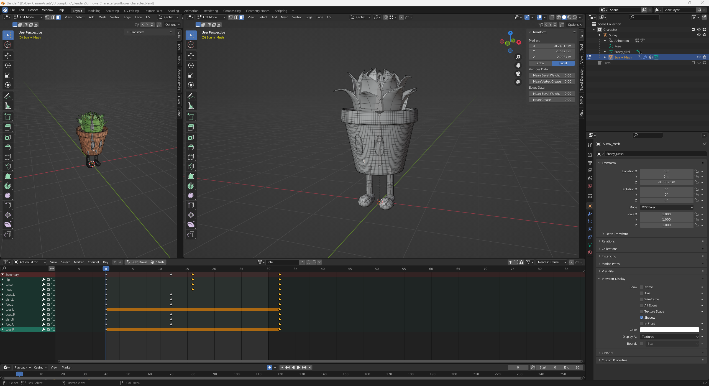

# IU_Jumpking

> Basic 3D Unreal Engine game project using C++ & BP.

## Table of Contents
- [Summary](#summary)
- [Tools](#tools)
- [Features](#features)
- [Project Structure](#project-structure)

## Summary

Initially creating as part of a 'collaborative work' university project.
The project implements basic Jump & Run mechanics inspired by the popuplar game [Jumpking](https://store.steampowered.com/app/1061090/Jump_King/) in 3D instead of 2D.

Created by two developers, intended as an exercise and portfolio project. The main objective was to use industry-standard, best practices to create a minimum viable product (MVP) with a realistic scope & timeline.

## Tools

> Tools used for the project.

Considering the relatively small of the project, the tools used are also kept simlpe as to not bloat workflows.

- **Unreal Engine**: Game Engine, game functionality & level design
- **Blender**: 3D Character modelling, animation & texturing
- **Notion**: Project planning & management (`Kanban`)
- **Discord**: Communication / `Scrum` meetings
- **Marketplace Assets**: We used 3 environment asset packs to design the vertical slice test level.

## Features

> Main features / mechanics of the game.

<strong>Interessting Jump Mechanic</strong>

---

- The Jump mechanic is the main feature of the game.
- Similar to it's 2D inspiration, the Jump works by standing still and loading up the jump distance.
- Jump height, distance and direction are calculated depending on jump button pressed duration and player rotation. 

  

---

<strong>Pickups</strong>

---

- Pickups can be found anywhere in the level.
- Pickups are a simple base class which can be derived from easily. 
- As of now there are 3 different pickup types: Coins, Health, Keys.

  

---

<strong>Checkpoints</strong>

---

- Checkpoints are activated by colliding with them. 
- They will be set the respawn point of the player.
- Unless the player runs out of `Lives` they will respawn there.
- Checkpoints will play an animation & spawn VFX on activation.

  

---

<strong>Win/Lose states</strong>

---

-  **Win Condition**: Reach the the `Goal`.
  - In the vertical slice level (see below), there is a goal object at the top of the hill.
  - Colliding with said object will result in the player's victory.
- **Lose Condition**: Lose all your `Lives`.
  - The player has 3 `Lives`.
  - `Lives` can be lost by colliding with any `Obstacle` placed in the level.
  - They may also be recovered by collecting a Health `Pickup`.

  

---

<strong>Level Design</strong>

---

- The Level design was planned using [Greyboxing](https://dev.epicgames.com/documentation/en-us/fortnite/greyboxing-in-unreal-editor-for-fortnite).
- Then realized using 3 Assets packs for the sky/water & environment.
- The main character and all obstacles, such as spikes, hammers, fireballs, etc. we're self-created.
  - Most of these are not in the vertical slice level yet as they were created at a later point.
  

---

<strong>Character Design & Animation</strong>

---

- Neither developer is an artist, thus the design & animations of the character were kept simple enough to be realizable for a programmer.
- Should still be slightly better than 'programmer art'! *(hopefully)*
  
  

---

